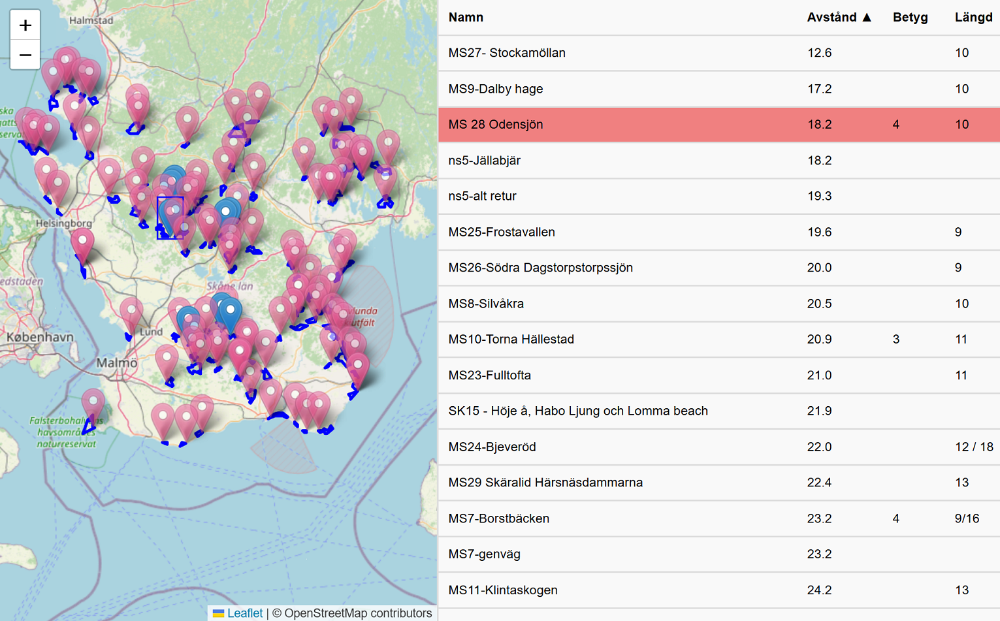

# Hikes

This is a web app that
* Displays a map with tracks/hikes
* Shows a corresponding table/list of the hikes
* Holds hike info that are mapped to the tracks/hikes.
* Also holds a "home" element for showing distance of the track from home.
* Provides means of logging/commenting/rating hikes.



# Dependencies
* [leaflet](https://leafletjs.com/) and [leaflet-gpx](https://github.com/mpetazzoni/leaflet-gpx) are used for resolving .gpx file info and displaying map.
* A `source.gpx` file assumed to co-exist in the webroot folder. Obtaining one is outside the scope of this project.
* PHP used for server side commands.

## hike_info.json
The "database" storing application specific data. Structured like,
``` jsonc
{
    "home": {  // The location used when computing distance to hikes.
        "name": <string>,
        "latlng": [ <latitude>, <longitude> ]       
    },
    "hikes": {
        <name>: { // The name is mapped to corresponding name in the gpx file
            "display_name": <string> // This is so one can give it custrom name while keeping the mapping
            "rate": <string>,
            "comment": <string>,
            "hike_length": <string>
        },
     ...
}
```
updated by invoking `server.php`.


